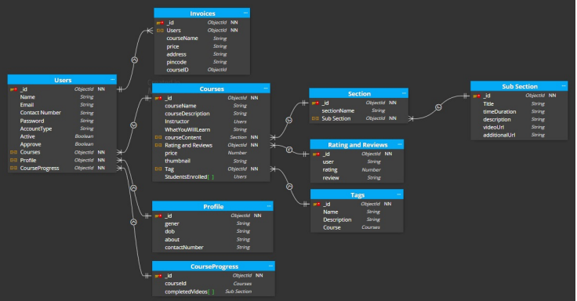

# StudyNotion - EdTech Platform
:rocket: [Link to website][]


StudyNotion is a fully functional EdTech platform that enables users to create, consume, and rate educational content. The platform is built using the MERN stack, which includes ReactJS, NodeJS, MongoDB, and ExpressJS.

## Table of Contents

- [Introduction](#introduction)
- [System Architecture](#system-architecture)
  - [Front-end](#front-end)
  - [Back-end](#back-end)
  - [Database](#database)
  - [Architecture Diagram](#architecture-diagram)
- [API Design](#api-design)
- [Installation](#installation)
- [Configuration](#configuration)
- [Usage](#usage)


## Introduction

StudyNotion is committed to transforming the educational journey for students everywhere, fostering an environment where learning is not only accessible but also captivating. Moreover, our platform serves as a hub for instructors to showcase their expertise and engage with learners from diverse backgrounds.

As we navigate through the following sections, we'll unveil the technical blueprint of our platform. From dissecting its architectural framework to illuminating the intricacies of API design, we'll guide you through installation, offer usage instructions, and illuminate the path to future enhancements. Join us on this transformative voyage to reimagine education.

## System Architecture

StudyNotion operates on a client-server architecture, comprising three key components: front-end, back-end, and database. The front-end serves as the user interface, while the back-end and database handle data processing and storage, respectively. 

### Front-end

StudyNotion's front-end, developed with ReactJS, crafts dynamic and responsive interfaces vital for an immersive learning journey. Leveraging RESTful API calls, it seamlessly interacts with the back-end, enhancing user engagement and experience.

#### Front End Pages

For Students:

- **Homepage:** Introduces users to the platform and provides quick access to the course list and user details.
- **Course List:** Displays all available courses, featuring comprehensive descriptions and ratings.
- **Wishlist:** Showcases courses added to the user's wishlist for easy reference.
- **Cart Checkout:**  Facilitates seamless completion of course purchases.
- **Course Content:** Offers in-depth exploration of course materials, including videos and supplementary resources.
- **User Details:** Presents comprehensive account information, including name, email, and relevant details.
- **User Edit Details:** Empowers students to modify and update their account information as needed.

For Instructors:

- **Dashboard:** Gives instructors an overview of their courses, displaying ratings and feedback for each.
- **Insights:** Provides detailed metrics on course performance, including views, clicks, and other relevant data.
- **Course Management Pages:** Empowers instructors to create, update, and remove courses, as well as manage content and pricing.
- **View and Edit Profile Details:** Allows instructors to access and modify their account information.

#### Front-end Tools and Libraries

In crafting the front-end, we harness the power of ReactJS for dynamic interfaces, CSS along with Tailwind for styling, and Redux for efficient state management.

### Back-end Infrastructure

At the heart of our platform lies a robust back-end powered by NodeJS and ExpressJS. This dynamic duo collaborates seamlessly to furnish APIs, enabling the front-end to interact effortlessly. From user authentication to course management, our back-end orchestrates a symphony of functionalities. It meticulously handles the intricate logic governing course content and user data, ensuring a seamless experience for all stakeholders.

#### Back-end Features

- **User Authentication and Authorization:** Students and instructors can sign up and log in to the platform using their email addresses and passwords. Enhanced security measures like OTP verification and password recovery fortify the authentication process.
- **Course Management:** Empowering instructors, our platform facilitates the entire lifecycle of course management. From creation to deletion, instructors wield control over content and media, while students browse and rate courses.
- **Payment Integration:** Simplifying transactions, students seamlessly navigate through the checkout process. Razorpay integration ensures secure payment handling, enabling hassle-free course enrollment.
- **Cloud-based Media Management:** Leveraging Cloudinary's prowess, our platform optimizes media management. Images, videos, and documents find a home in the cloud, ensuring seamless accessibility and scalability.
- **Markdown Formatting:** Course content in document format is stored in Markdown format, allowing for easier display and rendering on the front-end.

#### Back-end Frameworks, Libraries, and Tools

Our back-end thrives on a robust tech stack, including:

- **Node.js:** As the backbone of our infrastructure, Node.js powers our back-end operations.
- **Express.js:**  Fueling our web applications, Express.js empowers us with a suite of features for seamless development.
- **MongoDB:** Serving as our data powerhouse, MongoDB provides a flexible and scalable storage solution.
- **JWT (JSON Web Tokens):** Bolstering security, JWT ensures robust authentication and authorization mechanisms.
- **Bcrypt:** Adding layers of protection, Bcrypt fortifies our user data with robust password hashing.
- **Mongoose:** As our trusted ODM library, Mongoose facilitates seamless interaction with MongoDB using JavaScript.

#### Data Models and Database Schema

The back-end of StudyNotion uses several data models and database schemas to manage data, including:

- **Student Schema:** Housing vital information like name, email, and course details, this schema encapsulates each student's profile.
- **Instructor Schema:** Mirroring the student schema, this schema captures instructors' essential details, including name, email, and associated courses.
- **Course Schema:** Serving as the backbone of course management, this schema encompasses crucial elements like course name, description, instructor details, and media content.

### Database

StudyNotion's database relies on MongoDB, a versatile NoSQL solution renowned for its flexibility and scalability. MongoDB excels in handling unstructured and semi-structured data, offering a robust storage solution. Within this database reside essential information such as course content, user data, and other pertinent platform details.



### Architecture Diagram

Below is a high-level diagram that illustrates the architecture of the StudyNotion EdTech platform:


## API Design

The StudyNotion platform's API is crafted with simplicity and efficiency in mind, adhering to the REST architectural style. Powered by Node.js and Express.js, our API employs JSON for seamless data exchange. It leverages standard HTTP request methods like GET, POST, PUT, and DELETE to facilitate smooth communication between clients and servers.

For detailed API documentation and endpoints, refer to the [API Documentation](/api-docs).

## Installation

1. Clone the repository: `git clone https://github.com/username/repo.git`
2. Navigate to the project directory: `cd StudyNotion`
3. Install dependencies: `npm install`

## Configuration

1. Set up a MongoDB database and obtain the connection URL.
2. Create a `.env` file in the root directory with the following environment variables:
   ```
   MONGODB_URI=<your-mongodb-connection-url>
   JWT_SECRET=<your-jwt-secret-key>
   ```

## Usage

1. Start the server: `npm start`
2. Open a new terminal and navigate to the `client` directory: `cd client`
3. Start the React development server: `npm start`

Access the application in your browser at `http://localhost:3000`.

## POSTMAN Testing
https://documenter.getpostman.com/view/24441701/2s93kz6REm


